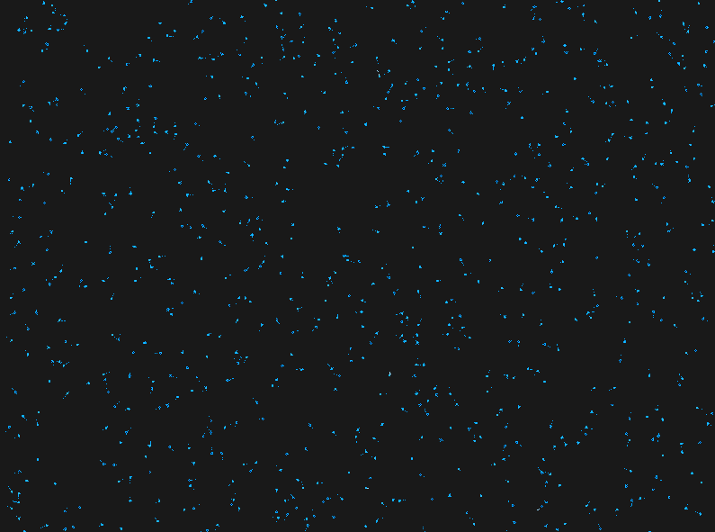

# Procedural Neural Tissue Simulation (OpenGL)

A biologically accurate, procedurally generated 2D simulation of a massive, multi-polar neural graph utilizing low-level C++ 20 and the OpenGL graphics pipeline.

| Binary Synaptic Transmission | Tissue-Scale Topology |
| :---: | :---: |
| <video src="https://github.com/blondon1/Procedural-Neuron-OpenGL/raw/main/artifacts/binary_synapse.mp4" width="350" autoplay loop muted playsinline></video> |  |  |
| *LIF Physics & Kinematic Signal Propagation* | *1,000-Node Algorithmic Graph & Synaptic Web* |

## Project Overview
This project is an ambitious exploration of the intersection between **fractal geometry**, **computational physics**, and **multi-agent networking**. By bridging the gap between rigid L-Systems and organic tissue, the engine utilizes hardware-accelerated shaders and dynamic heap allocation to simulate the complex morphology, electrical physics, and algorithmic self-organization of a living neural network.

## Engineering Journal
A transparent, chronological log of architectural decisions, research findings, and technical friction is maintained in the `artifacts/` directory. This journal serves as a strict mathematical and structural record of the project's evolution from a blank geometric window to a procedural tissue simulation.

**Read the full log here:** [Engineering_Journal.md](./artifacts/Engineering_Journal.md)

## Interactive Controls
The simulation features a mathematically scaled, dynamic orthographic camera for exploring the massive tissue sample:
* **W, A, S, D:** Planar translation (Pan Up, Left, Down, Right).
* **UP / DOWN Arrows:** Zoom In / Zoom Out (Translation speed scales dynamically with focal length).

## Key Engineering Milestones
* **Autonomous LIF Physics Engine:** Engineered a Leaky Integrate-and-Fire model using Euler integration to simulate membrane voltage decay, action potential thresholds (-55mV), and strict temporal refractory lockouts.
* **Heap-Allocated Memory Architecture:** Refactored the core execution loop into a `NeuralNetworkManager` utilizing `std::vector<std::unique_ptr<Neuron>>` to guarantee immutable memory addresses, strictly preventing `Synapse` pointer invalidation during massive dynamic array resizing.
* **Continuous Spatial Signal Propagation:** Decoupled network transmission from the soma's state machine, encapsulating action potentials into discrete `SignalPacket` entities that physically travel along $C^1$ continuous parametric splines (axons) before triggering target nodes.
* **Algorithmic Graph Topology:** Replaced rigid grid placements with an $O(N^2)$ Euclidean proximity loop, dynamically fusing weighted synapses between any nodes falling within a 4.0-unit biological radius, overlaying a massive `GL_LINES` synaptic web.

## Technical Stack
* **Language**: C++ 20 (Modern Standard)
* **Graphics API**: OpenGL 4.3 (Core Profile)
* **Build System**: CMake
* **Package Manager**: vcpkg
* **Libraries**: 
    * **GLFW**: Window, context management, and hardware interrupts
    * **GLAD**: Modern OpenGL function loading
    * **GLM**: Linear algebra and spatial coordinate transformation

## Algorithmic Deep Dive

### 1. Organic Membrane Webbing (SDF Blending)
To solve the "harsh corner" problem where dendrites meet the soma, the Fragment Shader calculates a **Signed Distance Field**. Using the `smoothstep` function, pixels dynamically fade based on proximity to the cellular core, creating a seamless, curved membrane union.

### 2. Stochastic L-System Morphology
The dendritic tree is generated using a non-deterministic L-System featuring **Symmetry Breaking** (probabilistic branching) and **Exponential Tapering**, simulating the massive flare of a primary trunk narrowing into a capillary via decaying trapezoids.

### 3. Spatial Validation (Rejection Sampling)
To ensure organic cellular territoriality, the procedural scatter algorithm utilizes Rejection Sampling. When proposing a stochastic $(X, Y)$ coordinate for a new cell, the engine calculates the distance to all existing cells. If it violates the 1.5-unit biological minimum radius, the coordinate is discarded and rerolled, entirely eliminating geometric clipping.

## Future Roadmap
The project is an active **Work In Progress (WIP)** with the following development phases:
- [x] **Phase 1**: Anatomical Soma/Dendrite Morphology & Hardware-Accelerated Blending.
- [x] **Phase 2**: Axon Topology & $C^1$ Parametric Splines.
- [x] **Phase 3**: LIF (Leaky Integrate-and-Fire) Physics & Temporal Dilation.
- [x] **Phase 4**: Kinematic Signal Propagation & Topological Networking.
- [x] **Phase 5**: Procedural Tissue Scatter & Euclidean Proximity Wiring.


## Build Instructions

### Prerequisites
* C++ 20 Compatible Compiler (MSVC, GCC, or Clang)
* [CMake](https://cmake.org/)
* [vcpkg](https://vcpkg.io/en/)

### Steps
1. **Clone the repository**:
   ```bash
    git clone [https://github.com/blondon1/Procedural-Neuron-OpenGL](https://github.com/blondon1/Procedural-Neuron-OpenGL)
    cd Procedural-Neuron-OpenGL
2. **Install Dependencies (vcpkg)**:
   Ensure `vcpkg` is installed and integrated. This project requires the following libraries:
   ```bash
    vcpkg install glfw3 glad glm
3. **Configure and Build**:
   Create a build directory and run CMake, pointing to your vcpkg toolchain file.
   ```bash
    mkdir build
    cd build
    cmake .. -DCMAKE_TOOLCHAIN_FILE=[path/to/vcpkg]/scripts/buildsystems/vcpkg.cmake
    cmake --build .
4. **Run the Simulation:**:
   Execute the compiled binary from the build directory.
   ```bash
    .\build\Debug\Neurons2D.exe

## License
This project is licensed under the **MIT License** - see the [LICENSE](https://opensource.org/license/MIT) file for details.