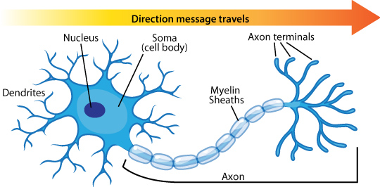
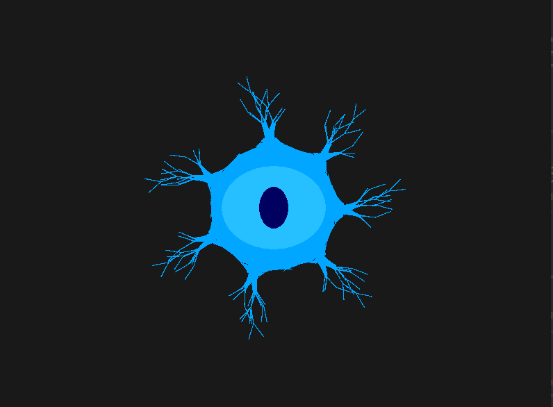

# Procedural-Neuron-OpenGL

A biologically accurate, procedurally generated 2D simulation of a multi-polar neuron utilizing low-level C++ 20 and the OpenGL graphics pipeline.


Biological Reference | Technical Render (OpenGL 4.3) |
| :---: | :---: |
|  |  |
| *Standard Multipolar Neuron Model* | *Real-time Stochastic L-System & SDF Blending* |

## Project Overview
This project is an ambitious exploration of the intersection between **fractal geometry** and **anatomical modeling**. By bridging the gap between rigid L-Systems and organic tissue, the simulation manipulates hardware-level memory and custom shader pipelines to replicate the complex morphology of a living cell.


## Engineering Journal
A transparent, chronological log of my architectural decisions, research findings, and technical friction is maintained in the `artifacts/` directory. This journal serves as a record of the project's evolution from a blank window to a procedurally generated biological simulation.

**Read the full log here:** [Engineering_Journal.md](./artifacts/Engineering_Journal.md)


### Key Engineering Milestones:
* **Hardware-Accelerated Blending**: Implemented a Signed Distance Field (SDF) in GLSL to resolve geometric friction between the soma and dendrites.
* **Stochastic Growth Algorithms**: Engineered a probabilistic state machine to replace deterministic "snowflake" patterns with asymmetrical, organic branching.
* **Object-Oriented Graphics Architecture**: Scaled the project to a 400+ line codebase utilizing a custom `RenderableShape` base class to manage VAO/VBO state for distinct cellular organelles.


## Technical Stack
**Language**: C++ 20 (Modern Standard)
**Graphics API**: OpenGL 4.3 (Core Profile)
**Build System**: CMake
**Package Manager**: vcpkg
**Libraries**: 
    **GLFW**: Window and context management
    **GLAD**: Modern OpenGL function loading
    **GLM**: Linear algebra and coordinate transformation


## Algorithmic Deep Dive

### 1. Organic Membrane Webbing (SDF Blending)
To solve the "harsh corner" problem where dendrites meet the soma, the Fragment Shader intercepts the `FragPos` and calculates a **Signed Distance Field**. Using the `smoothstep` function, pixels are dynamically faded based on their proximity to the cellular core, creating a seamless, curved membrane union.

### 2. Stochastic L-System Morphology
The dendritic tree is generated using a non-deterministic L-System.
* **Symmetry Breaking**: A probability matrix (35% Left, 35% Right, 30% Bilateral) ensures that no two primary dendrites are identical.
* **Exponential Tapering**: Instead of rectangular tubes, the branches utilize **decaying trapezoids**. The thickness is multiplied by $0.65$ at each micro-step, simulating the massive flare of a primary trunk narrowing into a capillary.

### 3. Somatic Submersion
To resolve triangular gaps at the tangent points, the origin of each dendrite is mathematically submerged $\approx 0.045$ units into the soma core, ensuring the flat geometric base is hidden within the shader's invisible zone.


## Future Roadmap
The project is an active **Work In Progress (WIP)** with the following development phases planned:
- [x] **Phase 1**: Anatomical Soma/Dendrite Morphology.
- [ ] **Phase 2**: Axon Topology (Single-path elongated geometry).
- [ ] **Phase 3**: LIF (Leaky Integrate-and-Fire) Mathematical Integration.
- [ ] **Phase 4**: Synaptic Networking (Communication between distinct cell instances).


## Build Instructions

### Prerequisites
* C++ 20 Compatible Compiler (MSVC, GCC, or Clang)
* [CMake](https://cmake.org/)
* [vcpkg](https://vcpkg.io/en/)

### Steps
1. **Clone the repository**:
   ```bash
    git clone [https://github.com/blondon1/Procedural-Neuron-OpenGL](https://github.com/blondon1/Procedural-Neuron-OpenGL)
    cd Procedural-Neuron-OpenGL
2. **Install Dependencies (vcpkg)**:
   Ensure `vcpkg` is installed and integrated. This project requires the following libraries:
   ```bash
    vcpkg install glfw3 glad glm
3. **Configure and Build**:
   Create a build directory and run CMake, pointing to your vcpkg toolchain file.
   ```bash
    mkdir build
    cd build
    cmake .. -DCMAKE_TOOLCHAIN_FILE=[path/to/vcpkg]/scripts/buildsystems/vcpkg.cmake
    cmake --build .
4. **Run the Simulation:**:
   Execute the compiled binary from the build directory.
   ```bash
    .\build\Debug\Neurons2D.exe