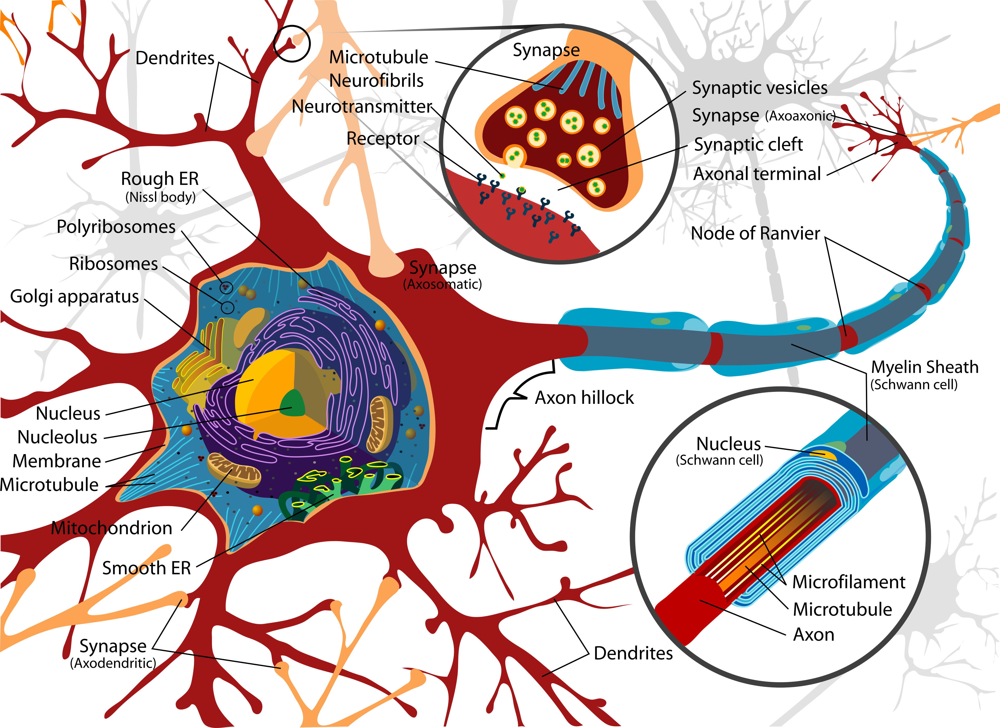
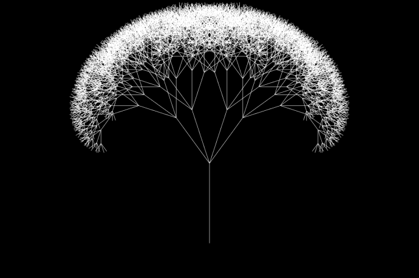
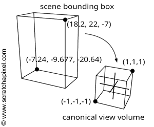
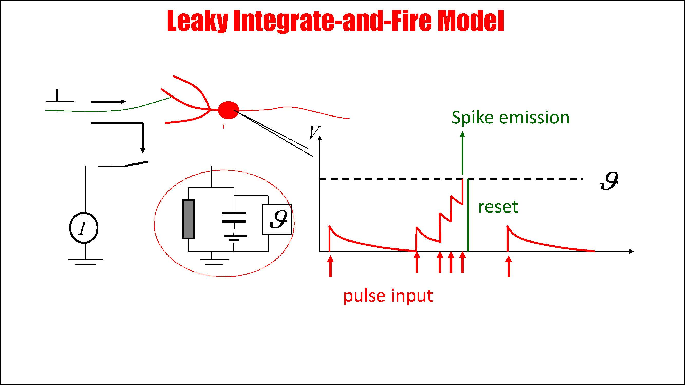

**The purpose of this journal is to provide a transparent, chronological log of my engineering decisions and problem-solving process for anyone reviewing this repository.**

# 2/26/2026
I built the foundations for the project using CMAKE as the build system with the vcpkg as the package manager, declared the gitignore filters for project organization, I'm using c++ 20 as the standard of my project(currently reading a tour of c++ by Bjarne Stroustrup so I'm applying the new guidelines), first time touching graphics programming on c++ so this is going to be fun

I decided to have my human readable code inside the src folder, and will begin preparing the systems architecture and requirement documents to define the scope, biological constraints,objectives for this development lifecycle.

It's amazing how they use fractal geometry to have better connectivity like other anatomical 
systems in the human body
Link: *https://www.nature.com/articles/s41598-021-81421-2*

Neural models are quite varied in complexity and in how many factors they consider, I think I should use the Leaky Integrate and Fire(LIF) model because of its simplicity, it is still a highly efficient linear encoder.
Lecture from Dr. Mario Negrello from the Erasmus Medical Center, Netherlands
Link: *//www.youtube.com/watch?v=xx45K9fuuO4&t=47s*

# 2/27/2026
I need to understand my environment deeply before I start engineering solutions for the problems of showcasing two neurons talking to each other through electrical signals first in 2D and then in 3D.

## Iterative process
**Source Code(as C++ 20)** > **CMake(as the generator)** > **MSVC(as the compiler)** > **Executable(.exe)**

## Tech Stack:
**C++ 20** modern standard
**CMake** build generator with instructions to the compiler
**vcpkg** package manager with dependencies
**OpenGL** is the API that dictates the guidelines to talk to the GPU
**GLFW** provides OpenGL with the container(window) for its context(textures, colors, shaders) and links them together
**GLM** handles the math to generate the matrices/vectors(math library) and the fundamental geometry of the simulation at the lowest level will be constructed using GPU optimized triangles
**glad** loads the modern functions of OpenGL 4.6 to the memory using pointers since Windows has those functions hidden and only knows how to talk to OpenGL 1.1 from 1997 without it.

## Biological Anatomy
The soma(body of the neuron) has the ability to send electrical signals through the axon and receive electrical signals from the dendrites to communicate with other neurons, I need to simulate first the body of the cell by iterating over the area of the circle we can get the sine and cosine for each angle and multiply them by the radius to get a circle.

# 2/28/2026
OpenGL has been a learning experience in udnerstanding the pipeline between CPU logic and raw GPU execution. At first, I was treating the graphics pipeline like a standard script—trying to force GLSL directly into my C++ environment and misunderstanding how the state machine tracks memory. I had to tear that down and rebuild my mental model around the strict Core Profile architecture: using VBOs to essentially rent out raw VRAM for my coordinate payloads, and VAOs as the orchestrators that tell the graphics card exactly how to parse that memory during the render loop. The real turning point was moving past hardcoded, static float arrays. Figuring out why my four vertices initially rendered a right triangle instead of a full rectangle forced me to understand how OpenGL fundamentally rasterizes primitives. Now, instead of manually plotting points, I'm shifting to procedural generation—encapsulating the math, into object-oriented structures that dynamically calculate and push coordinates into vector buffers. 

## Brainstorming on engineering dilemmas for the graphics programming simulation

Need a circle and an oval so the GL_TRIANGLE_FAN primitive should work for the soma and nuclei, using a central point and triangles from it and using the sin and cosine to calculate the radius, mark points on the circumference and connect them, when there's a big enough number of them the regular polygon will have so many straight edges that it looks like a smooth circle to the human eye

L-Systems algorithms are used to simulate the growth of fractal topologies like plants so I think I could apply this to the dendrites.  

I should use an an **Orthographic Projection Matrix construct** to allow definitions of C++
coordinates using biological units like micrometers, μm

**Subdivided Geometry** vs **Shader UV Propagation** for the LIF modeling of exponential charge in the neurons, **Subdivided Geometry** may cause the dentrite to have too many segments and LIF equations so it will scale terribly so **Shader UV Propagation** should allow me to unify the entire dentrite mathematically(LIF equation per neuron)

**Notes:**
The soma is essentialy a biological capacitor filled with ions
Key concepts of the LIF model: the neurons sums up electrical signals from other neurons, without input the voltage(electrical charge) slowly leaks away but if it crosses a threshold it creates a spike and after that it resets the voltage.

# 3/1/2026

OOD(Object Oriented Design)
So I have the following components that I have to implement in code, the nucleus as the DNA holder of the cell, the soma, the dendrites and the axon, firstly I want to focus on the nucleus and the soma to have a visual representation with a dark blue for the nucleus and a light blue for the soma, I will have a struct for all of them and a Neuron class to own the building parts of the cell, because there is a difference between has-a and is-a in OOD and a neuron owns its parts, but its parts do not inherit from them. Need a base class for the architecture to contain the VBO and VAO context to not have to repeat myself in the main function. The struct building components of the cell will inherit from the base class renderShape(not the Neuron class). The base class will 1- declare the VBO and VAO variables 2- generate the math on the cpu side for the shapes 3- generate the VBO object and VAO state manager on the GPU 4- draw the elements.